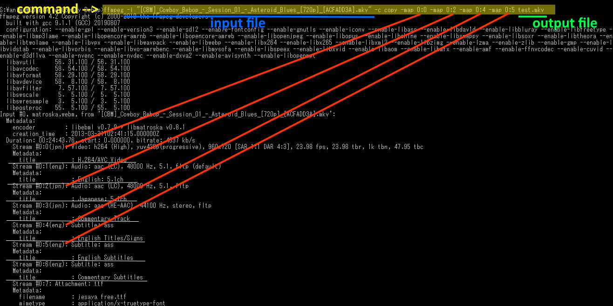

# demux

### Step-by-step usage

1. Download. Unzip `ffmpeg.zip` into `ffmpeg.exe`.

2. Put `ffmpeg.exe` and `demux.bat` in the folder containing the video files you want to
   work on.

3. Open `cmd` at this folder and run this command: **`ffmpeg -i "your video file.mp4"`**

4. Just provide the first file you are processing. Don't worry if it's not an mp4.
   ffmpeg should show you the available streams on your file.
   
5. **Note down which streams you want to include in the outputs.** (refer to image above)

6. Right-click and edit `demux.bat`. Look for the Settings section at the top.

7. Edit `fileFormat` to match your files, for example: **`.mp4`** (no spaces)

8. Edit `mapStreams`, specifying only the streams you need. You have to repeat `-map` for
   each stream.

9. You can change the name of `outputFolder` if you want.

10. Save, then double-click on `demux.bat`. The processed files will show up in the
specified output folder.
